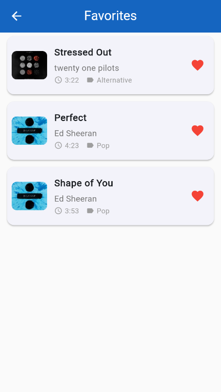

# 🎵 Flutter Music App

A beautiful music app built with Flutter that allows users to search for songs, play previews, and manage their favorite tracks.

## ✨ Features

- 🔍 **Search Songs**: Search for songs using the iTunes API
- 🎧 **Play Previews**: Listen to 30-second song previews
- ❤️ **Favorites**: Save and manage favorite songs locally
- 🌓 **Dark/Light Theme**: Toggle between dark and light themes
- ♾️ **Infinite Scroll**: Load more songs as you scroll
- 💾 **Offline Support**: View favorites even when offline
- 🎨 **Blue Theme**: Beautiful blue color scheme throughout the app

## 📁 Project Structure

```
music_app/
├── lib/
│   ├── main.dart                           # App entry point
│   ├── models/
│   │   └── song_model.dart                 # Song data model
│   ├── providers/
│   │   ├── song_provider.dart              # Song state management
│   │   ├── favorites_provider.dart         # Favorites state management
│   │   └── theme_provider.dart             # Theme state management
│   ├── screens/
│   │   ├── home_screen.dart                # Home screen with search
│   │   ├── song_detail_screen.dart         # Song details & player
│   │   └── favorites_screen.dart           # Favorites list
│   ├── services/
│   │   └── api_service.dart                # iTunes API integration
│   ├── utils/
│   │   └── theme.dart                      # App theme configuration
│   └── widgets/
│       ├── song_list_item.dart             # Song list item widget
│       └── shimmer_loading.dart            # Loading skeleton
├── pubspec.yaml                            # Dependencies
└── README.md                               # This file
```

## 🎨 Theme

The app features a beautiful blue color scheme:
- **Primary Blue**: `#2196F3`
- **Dark Blue**: `#1976D2`
- **Light Blue**: `#64B5F6`
- **Accent Blue**: `#03A9F4`


## 📸 App Screenshots

<table align="center">
  <tr>
    <td align="center">
      <br/>
      <b>Home Screen</b>
    </td>
    <td align="center">
      <br/>
      <b>Detail Screen</b>
    </td>
    <td align="center">
      <br/>
      <b>Detail Screen 2</b>
    </td>
    <td align="center">
      <br/>
      <b>Favorites</b>
    </td>
  </tr>
</table>


## 💾 Local Storage

- **Favorites**: Stored using SharedPreferences
- **Theme Preference**: Saved locally
- **Data Persistence**: Survives app restarts

## 🎮 Audio Player Features

- Play/Pause controls
- Seek bar with time display
- Skip forward/backward 10 seconds
- Auto-stop at preview end


## 📄 License

This project is open source and available under the MIT License.

## 👨‍💻 Development


### Key Features Implementation:

- **Provider Pattern**: Clean state management
- **Separation of Concerns**: Models, Services, Screens, Widgets
- **Reusable Widgets**: Modular component design
- **Error Handling**: Comprehensive error states
- **Performance**: Image caching, lazy loading
- **UX**: Shimmer loading, smooth animations


Built with ❤️ using Flutter
